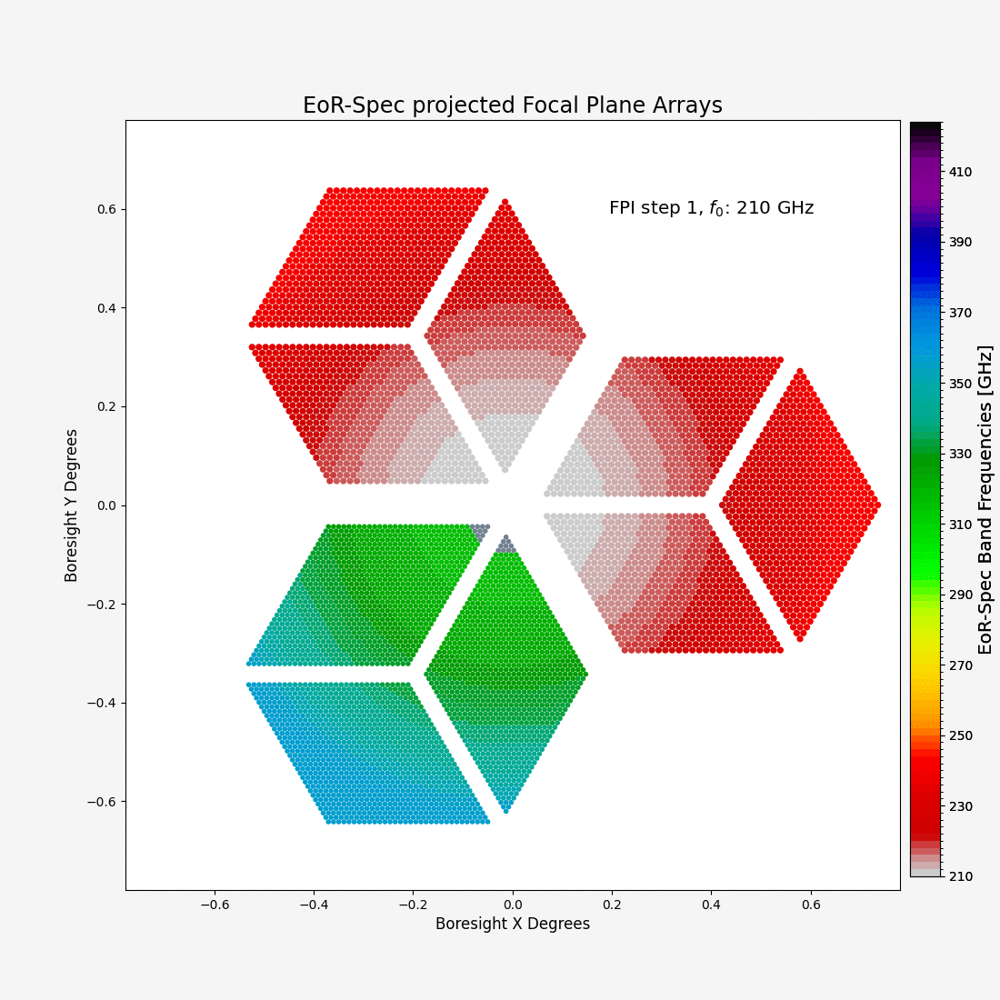

# eorspec_focalplane

This set of scripts makes detector tables for EoR-Spec focalplane simulation in the TOASTv3 format.

The two cases are:
* We want to view the full focalplane with different frequencies at a single FPI step
* We want to simulate 1 frequency channel that are illuminated at multiple FPI steps

Final output(s) is/are Astropy Detector table(s) with Detector parameters which can provided as argument
for a TOAST FocalPlane Class.

### EoR-Spec Focal Plane simulation for 15 FPI steps

EoR-Spec Frequency and Annulus data taken from:
https://github.com/ccatobs/eor_spec_mapping_simulations/blob/align_camera_simulations/eor_spec_mapping_simulations/inputs/annulus_radii.csv

---

**Corresponding Author**: Ankur Dev (adev@astro.uni-bonn.de)

### Acknowledgements:

We thank the following collaborators for valuable discussions and support with these Focal Plane simulations: 
Yoko Okada, Thomas Nikola, Gordon Stacey, Rodrigo Freundt and EoR-Spec instrument team

